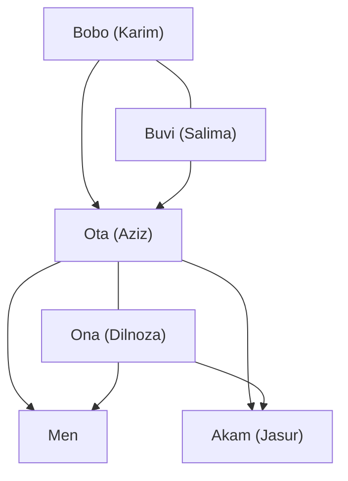

# Bizning oila shajarasi

```mermaid
graph TD
    A["Bobo (Karim)"] --- B["Buvi (Salima)"]
    A --> C["Ota (Aziz)"]
    B --> C
    C --- D["Ona (Dilnoza)"]
    C --> E["Men"]
    D --> E
    C --> F["Akam (Jasur)"]
    D --> F
```
