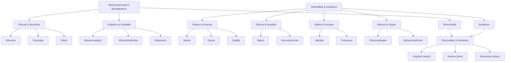

# Bizning oila shajarasi

```mermaid
graph TD
    %% ===== OTA TOMON =====
    PB["Shermuhammad & Muhabbatxon"]
    PB --> DAD["Sherzodbek"]
    PB --> A1["Dilnoza & Bozorboy"]
    PB --> A2["Gulbahor & Sirojiddin"]

    A1 --> A1a["Boburjon"]
    A1 --> A1b["Farxodjon"]
    A1 --> A1c["Odina"]

    A2 --> A2a["Muhammadaziz"]
    A2 --> A2b["Muhammadsodiq"]
    A2 --> A2c["Robiyaxon"]

    %% ===== ONA TOMON =====
    MB["Dilshodbek & Inobatxon"]
    MB --> MOM["Ibodatxon"]
    MB --> X1["Dilafruz & Azamat"]
    MB --> X2["Dilnoza & Nuriddin"]
    MB --> X3["Dildora & Inomjon"]
    MB --> X4["Dilorom & Oybek"]

    X1 --> X1a["Sardor"]
    X1 --> X1b["Diyora"]
    X1 --> X1c["Oyatillo"]

    X2 --> X2a["Nigora"]
    X2 --> X2b["Nurmuhammad"]

    X3 --> X3a["Iqboljon"]
    X3 --> X3b["Fotimaxon"]

    X4 --> X4a["Shukronabegim"]
    X4 --> X4b["MuhammadUmar"]

    %% ===== BIZNING OILA =====
    DAD --> PAR["Sherzodbek & Ibodatxon"]
    MOM --> PAR
    PAR --> K1["Ulug'bek (akam)"]
    PAR --> K2["Mubina (men)"]
    PAR --> K3["Sherozbek (ukam)"]
```
